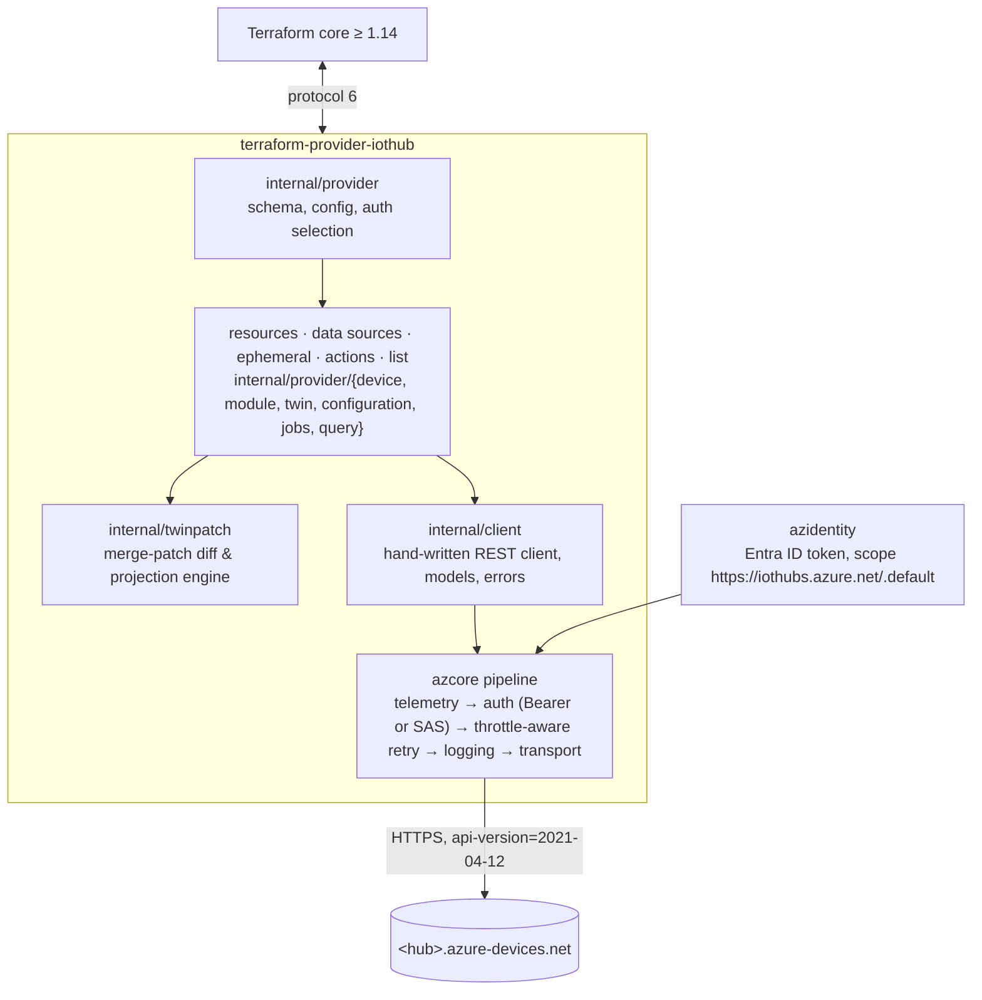

# terraform-provider-iothub — Concept

**A Terraform provider for the Azure IoT Hub data plane** — the identity registry, device/module twins, automatic device management & IoT Edge deployments, jobs, queries and direct methods that the IoT Hub *Service REST API* exposes and that `azurerm` (Azure Resource Manager) does not.

| | |
|---|---|
| Status | Concept / RFC — v0.10, 2026-08-15 (decisions resolved, §15; verified against a live hub, Appendix D) |
| Scope | IoT Hub **Service REST API** (`https://<hub>.azure-devices.net`, `api-version=2021-04-12`) |
| Out of scope | Everything under Azure Resource Manager (`Microsoft.Devices/*`), the device-side Messaging API, AMQP-only operations, sovereign clouds |
| Name | `terraform-provider-iothub`, registry `<namespace>/iothub`, resource prefix `iothub_` |
| Terraform | ≥ 1.14 |

---

## 1. Summary

`azurerm` manages the *hub* (`azurerm_iothub`, routes, endpoints, enrichments, DPS, certificates, shared access policies). It cannot manage anything *inside* the hub, because that surface is a separate data-plane API with its own host, auth model and throttling. The upstream feature request ([hashicorp/terraform-provider-azurerm#12604](https://github.com/hashicorp/terraform-provider-azurerm/issues/12604), "azurerm_iothub_device") was closed as *not planned* with the label `sdk/not-yet-supported`; the suggested workaround is the `shell` provider wrapping `az iot hub device-identity`. No community provider for this surface exists on the Terraform Registry or GitHub (verified 2026-08-15).

This concept proposes a dedicated provider that:

- authenticates with **Microsoft Entra ID** by default (RBAC data actions, `https://iothubs.azure.net/.default`) and with **shared-access-policy SAS tokens** as a fallback;
- models the registry and twins as **managed resources** (`iothub_device`, `iothub_module`, `iothub_device_twin`, `iothub_module_twin`, `iothub_configuration`, `iothub_edge_deployment`);
- models one-shot operations as **Terraform Actions** (`iothub_direct_method`, `iothub_scheduled_job`, `iothub_import_export_job`, `iothub_apply_configuration`, `iothub_purge_c2d_queue`, …) instead of pretending they are resources;
- keeps device credentials out of state where possible via **ephemeral resources** and **write-only arguments**;
- ships **list resources** and a **query data source** for discovery/import;
- is built to survive IoT Hub's aggressive **throttling** (100 registry ops/min/unit on S1) with time-budgeted `429`/`503` retries (honouring `Retry-After`) instead of client-side rate limits, plus clear scale guidance.

Everything is grounded in the [IoT Hub REST reference](https://learn.microsoft.com/en-us/rest/api/iothub/) — Appendix B maps every endpoint to a Terraform construct (or states why it is not covered).

---

## 2. Problem, boundary and prior art

### 2.1 Two planes, one product

```mermaid
flowchart LR
  subgraph ARM["Control plane — Azure Resource Manager (management.azure.com)"]
    A1[azurerm_iothub]
    A2["azurerm_iothub_route / endpoint / enrichment"]
    A3[azurerm_iothub_shared_access_policy]
    A4[azurerm_iothub_certificate]
    A5[azurerm_iothub_dps]
    A6[azurerm_role_assignment]
  end
  subgraph DP["Data plane — Service REST API (&lt;hub&gt;.azure-devices.net)"]
    D1["Device &amp; module identities"]
    D2["Device &amp; module twins"]
    D3[Configurations / Edge deployments]
    D4[Jobs, direct methods]
    D5[Query, statistics, digital twins]
  end
  ARM -- creates the hub, grants RBAC --> DP
  style DP fill:#e8f1fb,stroke:#3b6ea5
```



`azurerm` stops at the ARM boundary. The proposed provider starts exactly there and never crosses back: it does not create hubs, does not touch SKUs, routing, endpoints, policies, certificates, private endpoints or DPS. A hub name/hostname produced by `azurerm_iothub` is the hand-over point.

### 2.2 In scope — the Service REST API

Operation groups of the Service API (api-version 2021-04-12): **Bulk Registry, Cloud-To-Device Messages, Configuration, Devices, Digital Twin, Jobs, Modules, Query, Statistics**.

### 2.3 Explicitly out of scope

| Area | Why |
|---|---|
| Anything under `Microsoft.Devices/*` (ARM) | Owned by `azurerm`; duplicating it would create two sources of truth. |
| Device Messaging API (`/devices/{id}/messages/events`, `deviceBound`, file upload) | Device-side runtime traffic authenticated with device credentials, not infrastructure. |
| Sending cloud-to-device messages | Only available over AMQP in the service SDKs — not part of the REST surface. |
| Receiving C2D feedback / file-upload notifications | Long-poll queue consumers; not a declarative concern. Only `purge` (a one-shot side effect) is covered. |
| Sovereign clouds (Azure Government `*.azure-devices.us`, Azure China `*.azure-devices.cn`) | Public cloud only for now — different token scopes/authorities; nothing in the design prevents adding them later. |
| Device Provisioning Service data plane (enrollments) | Different host (`*.azure-devices-provisioning.net`), different spec. Same gap, same pattern — a natural **sister scope** for a later phase (see §14). |

### 2.4 Prior art checked

- `hashicorp/terraform-provider-azurerm` #12604 / #9416 — closed, not planned.
- Terraform Registry search and GitHub code/repo search — no `iothub` data-plane provider. Closest analog: `KenSpur/terraform-provider-azure-iot-central` (IoT Central data plane, plugin-framework, 2023).
- Go SDKs: there is **no official Azure IoT Hub service SDK for Go**. `amenzhinsky/iothub` (57★, MIT, last push 2024-04, pre-1.0) is SAS-only and AMQP-centric — unsuitable as a foundation. The provider therefore ships its **own thin REST client** on top of `azcore`/`azidentity` (§12).

---

## 3. Design principles

1. **Mirror the API, not the CLI.** Resource attributes and enum literals follow the REST schema (`selfSigned`, `certificateAuthority`, `scheduleUpdateTwin`) so Microsoft's docs remain the reference. Attribute *names* are snake_case per Terraform convention.
2. **Resources for state, actions for events.** If the API object has a lifecycle (create/read/update/delete, ETag) it is a resource. If it is a request that *happens* (invoke, schedule, purge, apply), it is an Action — never a resource with a fake delete.
3. **Partial ownership of twins.** Terraform owns exactly the leaf paths it declares in `tags`/`desired` and leaves everything else (backend-written keys — even inside objects Terraform declares — `$metadata`, reported properties) alone.
4. **Secrets are optional in state.** Hub-generated keys are stored `Sensitive` (pragmatic default, same as `azurerm`), user-supplied keys can be write-only, and ephemeral resources deliver connection strings/SAS tokens without ever persisting them.
5. **Throttle-aware by construction.** No client-side rate limits — the service is the authority on its own throttle; every call is retried on `429`/`503` within the operation's time budget, and docs state the refresh cost of N devices per tier.
6. **Entra ID first, SAS second.** RBAC data actions are documented per resource; SAS stays for hubs that must keep local auth (e.g. DPS-linked hubs).

---

## 4. Provider configuration

### 4.1 Naming

- Repository: `terraform-provider-iothub`; registry address `<namespace>/iothub`; prefix `iothub_`.
  Reads naturally next to `azurerm_iothub` (`azureiothub` was considered and rejected as redundant next to `azurerm`).

### 4.2 Technology

| Concern | Choice |
|---|---|
| Language / SDK | Go ≥ 1.24, [terraform-plugin-framework](https://github.com/hashicorp/terraform-plugin-framework) v1.19+ (protocol 6) — ephemeral resources, write-only args, actions, list resources |
| Terraform baseline | **≥ 1.14** (GA Nov 2025). Actions and list resources are first-class in this model, so one baseline that has everything — actions, list resources, ephemeral resources (1.10), write-only arguments (1.11) — beats a split feature matrix |
| Azure auth | `azcore` + `azidentity` (Entra ID); custom SAS policy for shared access keys |
| REST client | Hand-written, `azcore` `runtime.Pipeline` (retry, logging, telemetry, auth, rate-limit policies) — see §12 |
| Docs / tests / release | `terraform-plugin-docs`, `terraform-plugin-testing`, GoReleaser, GPG-signed registry publishing |

### 4.3 Configuration block

```hcl
provider "iothub" {
  # Default hub for all resources; may be overridden per resource.
  hostname = "contoso-prod.azure-devices.net"      # env IOTHUB_HOSTNAME

  # --- Authentication: Entra ID (default) ------------------------------
  # Uses azidentity chain: explicit client credentials → workload identity /
  # OIDC (GitHub Actions, HCP Terraform) → managed identity → Azure CLI.
  # tenant_id / client_id / client_secret / client_certificate_path /
  # use_oidc / use_msi / use_cli  — same names & env vars as azurerm
  # (ARM_TENANT_ID …) plus native AZURE_TENANT_ID … so both providers can
  # share one environment. Public cloud only (authority login.microsoftonline.com).

  # --- Authentication: shared access policy (fallback) -----------------
  # connection_string = "HostName=…;SharedAccessKeyName=iothubowner;SharedAccessKey=…"   # env IOTHUB_CONNECTION_STRING
  # (the only SAS input — azurerm_iothub_shared_access_policy exposes it directly)

  # There are deliberately no behaviour knobs: ETag handling (§11.1),
  # throttling (§11.2) and the REST api-version (§11.6) are fixed by the
  # provider, not chosen by the user.
}
```

Auth mode is inferred: `connection_string` present → SAS, otherwise Entra ID. Provider *configuration* never depends on the hub itself when Entra ID is used, which is what makes single-root-module bootstrapping possible (§4.4).

**Token scope:** `https://iothubs.azure.net/.default` (public cloud; sovereign clouds are out of scope).

**Required RBAC** (assign at hub scope): *IoT Hub Data Contributor* (`Microsoft.Devices/IotHubs/*`) covers everything; least-privilege split: *IoT Hub Registry Contributor* (`devices/*` only — no twins), *IoT Hub Twin Contributor* (`twins/*`), *IoT Hub Data Reader* (`*/read`). **`Owner`/`Contributor` grant no data actions at all** — a subscription owner still gets 401 on the data plane until one of these roles is assigned. Per-construct data actions in Appendix C.

### 4.4 Hub addressing, IDs and import

- Every resource/data source/action has an optional `hostname` attribute overriding the provider default (precedent: AWS provider ≥ 6.0 per-resource `region`).
  This matters for bootstrapping: `hostname = azurerm_iothub.hub.hostname` is *unknown* during the first plan of a fresh root module. Unknown **resource** attributes are fine; unknown **provider** attributes are not. With Entra ID auth the provider block needs no hub-specific value at all, so hub and hub content can live in one module.
- Resource IDs mirror REST paths and are the import format:

| Resource | ID / import string |
|---|---|
| `iothub_device` | `<hostname>/devices/<deviceId>` |
| `iothub_module` | `<hostname>/devices/<deviceId>/modules/<moduleId>` |
| `iothub_device_twin` | `<hostname>/twins/<deviceId>` |
| `iothub_module_twin` | `<hostname>/twins/<deviceId>/modules/<moduleId>` |
| `iothub_configuration`, `iothub_edge_deployment` | `<hostname>/configurations/<id>` |

Multiple hubs: either per-resource `hostname` or provider aliases — both work.

---

## 5. Resource model at a glance

| Terraform construct | Kind | Backing API |
|---|---|---|
| `iothub_device` | resource · data source · list | Devices: Create/Update/Get/Delete Identity |
| `iothub_module` | resource · data source · list | Modules: Create/Update/Get/Delete Identity, Get Modules On Device |
| `iothub_device_twin` | resource · data source | Devices: Get/Update Twin (PATCH) |
| `iothub_module_twin` | resource · data source | Modules: Get/Update Twin (PATCH) |
| `iothub_configuration` | resource · data source · list | Configuration: Create/Update/Get/Delete (deviceContent / moduleContent) |
| `iothub_edge_deployment` | resource · data source · list | Configuration: Create/Update/Get/Delete (modulesContent) |
| `iothub_query` | data source | Query: Get Twins (`SELECT … FROM devices \| devices.modules \| devices.jobs`) |
| `iothub_statistics` | data source | Statistics: Get Device Statistics + Get Service Statistics |
| `iothub_scheduled_job`, `iothub_import_export_job` | data source (status) | Jobs: Get Scheduled Job / Get Import Export Job |
| `iothub_digital_twin` | data source | Digital Twin: Get |
| `iothub_device_credentials`, `iothub_module_credentials` | ephemeral | Get Identity (keys → connection strings) |
| `iothub_device_sas_token` | ephemeral | Get Identity + local HMAC (device SAS token) |
| `iothub_direct_method` | action | Devices/Modules: Invoke Method |
| `iothub_scheduled_job` | action | Jobs: Create Scheduled Job (+ Get/Cancel for wait) |
| `iothub_import_export_job` | action | Jobs: Create Import Export Job (+ Get/Cancel for wait) |
| `iothub_apply_configuration` | action | Configuration: Apply On Edge Device |
| `iothub_purge_c2d_queue` | action | Cloud To Device Messages: Purge Queue |
| `iothub_digital_twin_command` | action | Digital Twin: Invoke Root Level / Component Command |
| `iothub_cancel_job` | action | Jobs: Cancel Scheduled / Import Export Job |

Deliberately **not** resources: jobs (one-shot, 30-day retention → a resource would re-run itself when history expires), digital twins (PnP writable properties *are* desired properties; use `iothub_device_twin`), bulk registry (Terraform's unit is one object; bulk import is an action).

---

## 6. Resources

### 6.1 `iothub_device` — identity registry entry

```hcl
resource "iothub_device" "gateway" {
  device_id    = "gw-munich-01"          # required, immutable (RequiresReplace), 1–128 chars, registry charset
  edge_enabled = true                    # capabilities.iotEdge — updatable in place
  status       = "enabled"               # enabled | disabled (default enabled)
  status_reason = "commissioned 2026-08"

  authentication {                       # optional; default: sas with hub-generated keys
    type = "certificateAuthority"        # sas | selfSigned | certificateAuthority
    # sas:        primary_key / secondary_key   (Optional+Computed, Sensitive)
    #             primary_key_wo / secondary_key_wo + *_wo_version (write-only alternative)
    # selfSigned: primary_thumbprint / secondary_thumbprint
  }
}

resource "iothub_device" "sensor" {
  device_id    = "s-0001"
  parent_scope = iothub_device.gateway.device_scope   # makes it a child of the gateway
  authentication { type = "sas" }
}
```

Computed: `id`, `etag`, `generation_id`, `device_scope`, `parent_scopes`, `connection_state`, `connection_state_updated_time`, `last_activity_time`, `status_updated_time`, `cloud_to_device_message_count`.

Behaviour:

| Op | Call | Notes |
|---|---|---|
| Create | `PUT /devices/{id}` **without** `If-Match` | The service treats a `PUT` without `If-Match` as create-only: 409 `DeviceAlreadyExists` if the ID exists → "already exists — import it". (`If-None-Match` is not part of this API; verified.) |
| Read | `GET /devices/{id}` | 404 `DeviceNotFound` → remove from state. Keys read back into state (Sensitive). |
| Update | `PUT /devices/{id}` **with** `If-Match: "<etag>"` (see §11.1) | `If-Match` is what makes the `PUT` an update (without it: 409; on a missing device: 404). Full-body replace — **omitting `authentication` makes the hub mint new keys**, so the provider always sends the complete identity from plan+state. |
| Delete | `DELETE /devices/{id}` with `If-Match: *` | `If-Match` is **required** on delete (412 "Etag missing" without it); a missing device returns 404 → treated as success. Deletes the twin and all modules implicitly. |

Parent/child mapping (as the Azure CLI does it, verified): for a **leaf** device `parent_scope` is written to `deviceScope` — the hub then also fills `parentScopes[0]`; for an **edge** device (`edge_enabled = true`) it is written to `parentScopes[0]` while `deviceScope` stays hub-generated (`ms-azure-iot-edge://<id>-<ticks>`; a user-supplied value is silently ignored). A leaf with only `parentScopes` is silently ignored — hence the mapping. One parent per device. `edge_enabled` toggles in place in both directions (a device toggled *to* edge gets a scope without generation suffix, `ms-azure-iot-edge://<id>-`).

Edge devices get `$edgeAgent`/`$edgeHub` module identities implicitly; `iothub_module` (identity) rejects `$`-prefixed IDs, while `iothub_module_twin` accepts them — per-device desired-property overrides on the system modules are legitimate.

Validation and normalization (verified against the service):
- Thumbprints: the hub **rejects** separators (`aa:bb:…` → 400 `StringIsNotThumbprint`) and stores hex **as given** (lowercase stays lowercase); the twin echoes it as `PrimaryThumbprint` (capitalized). The provider validates the format up front and compares case-insensitively.
- Symmetric keys: base64 of 16–64 bytes (`Invalid device key length` otherwise), **both or neither** (`Either no keys or both keys can be set`) — relevant for write-only rotation: when only `primary_key_wo` changes, the provider sends the secondary from state alongside. Keys are echoed byte-for-byte.
- `authentication.type = "none"` is rejected for devices (`DeviceAuthenticationTypeIsMissing`) and silently coerced to `sas` for modules — the schema does not offer it.
- `selfSigned` without any thumbprint is accepted by the hub; the provider requires at least `primary_thumbprint` because such a device can never authenticate.

### 6.2 `iothub_module` — module identity

```hcl
resource "iothub_module" "telemetry" {
  device_id  = iothub_device.sensor.device_id   # RequiresReplace
  module_id  = "telemetry"                       # RequiresReplace
  managed_by = "operator"                        # optional
  authentication { type = "sas" }
}
```
Same auth block, same computed fields, same create/update/delete semantics as `iothub_device` (create-only without `If-Match` → 409 `ModuleAlreadyExistsOnDevice`; delete requires `If-Match`). Backing: `PUT/GET/DELETE /devices/{id}/modules/{mid}` (returns 200, not the documented 201).

### 6.3 `iothub_device_twin` / `iothub_module_twin` — partial ownership of tags & desired properties

The twin exists as soon as the identity exists; this resource does not create or delete a twin — it **owns a set of leaf paths** inside it.

```hcl
resource "iothub_device_twin" "sensor" {
  device_id = iothub_device.sensor.device_id
  tags = jsonencode({
    site  = "munich"
    fleet = { region = "eu", ring = 2 }
  })
  desired_properties = jsonencode({
    telemetryIntervalSec = 60
    firmware             = { channel = "stable" }
  })
}
```

- `tags` and `desired_properties` are JSON strings with a normalized JSON custom type (semantic equality → no diffs on key order/whitespace).
- **Ownership is by leaf path.** Terraform owns exactly the leaf paths it declares (`tags.site`, `tags.fleet.region`, `tags.fleet.ring`, `desired.firmware.channel`, …). Arrays and empty objects are leaves. Anything else in the twin — other top-level keys *and* siblings inside objects Terraform declares (a backend writing `desired.firmware.lastCheck` next to our `desired.firmware.channel`) — is never read, diffed or written.
- **Update** = diff of owned leaves between prior state and plan → a JSON *merge patch* (`PATCH /twins/{id}`, `If-Match: *`): changed/added leaves are set; removed leaves are nulled. When removing, the provider first re-reads the twin (twin reads are cheap) and nulls the highest ancestor whose remote subtree consists only of Terraform-owned leaves, otherwise just the leaves — so removing `firmware = {…}` deletes the whole `firmware` object if nobody else wrote into it, and leaves foreign siblings intact if they did.
- **Read** projects the remote twin onto the owned leaf set from prior state; `$metadata`/`$version` are stripped. External changes or removals of owned leaves show as drift; everything else is invisible.
- **Import yields an empty owned set.** The first apply adopts the configured leaves via merge patch (a remote no-op where values already match). Import can therefore never wipe keys the configuration doesn't mention.
- **Destroy nulls the owned leaves** (same ancestor rule). To stop managing a twin *without* touching it, use Terraform's own mechanism: `removed { from = iothub_device_twin.x  lifecycle { destroy = false } }`.
- Client-side validation covers what Terraform sends: depth ≤ 10, keys without `.`, `$`, space, ≤ 4 KB per value. The section-level caps (tags ≤ 8 KB, desired ≤ 32 KB) apply to the *whole* twin including keys Terraform does not own, so they are enforced by the hub and surfaced as its error.
- Computed: `etag`, `version`. Reported properties are exposed on the **data source** only (device-driven, would only churn resource state).
- If the identity is destroyed first, `DELETE` tolerates 404.

Backing: `GET /twins/{id}`, `PATCH /twins/{id}`; module variant `/twins/{id}/modules/{mid}` (a missing module twin reports 404 `DeviceNotFound`, not `ModuleNotFound`). Twin reads/writes are throttled at 100/s and 50/s (S1) — practically unconstrained. Verified: `PATCH` with `If-Match: *` is conflict-free even under 30 concurrent writes to the same twin; the twin ETag (`AAAAAAAAAAE=`, a counter) moves only on tag/desired writes — not on identity changes, connects or telemetry.

### 6.4 `iothub_configuration` — automatic device/module management

```hcl
resource "iothub_configuration" "fw_channel" {
  configuration_id = "fw-channel-stable"                          # RequiresReplace
  target_condition = "tags.fleet.region='eu' AND tags.kind='leaf'"   # only deviceId / tags / properties.reported allowed
  priority         = 10
  labels           = { owner = "platform" }
  device_content = jsonencode({                                   # RequiresReplace (content is immutable)
    "properties.desired.firmware" = { channel = "stable" }
  })
  # module_content = jsonencode({...})   # exactly one of device_content / module_content
  metrics = {                                                      # custom metric queries (updatable)
    applied = "SELECT deviceId FROM devices WHERE properties.reported.firmware.channel='stable'"
  }
}
```
Computed: `etag`, `schema_version`, `created_time_utc`, `last_updated_time_utc`, `system_metrics` (targeted/applied counts).
`id` and `content` are immutable per API ("Configuration identifier and Content cannot be updated") → RequiresReplace. **Verified: a `PUT` with changed content returns 200 and silently keeps the old content** — so the provider *must* enforce replacement itself; the API gives no signal. `priority`, `target_condition`, `labels`, `metrics` (and `schema_version`) update in place with a **quoted** `If-Match: "<etag>"` (an unquoted value yields a misleading 409 `ConfigurationAlreadyExists`); the body must include `content` on every update (400 `InvalidConfigurationContent` otherwise). Target conditions may only reference `deviceId`, `tags` and `properties.reported`.
Plan-time validation (fixed behaviour, no knob): when `target_condition` or `metrics` change in the plan, `ModifyPlan` calls `POST /configurations/testQueries` so a typo surfaces before apply — one call per *changed* configuration, skipped while the hostname is unknown, and degraded to a warning (not a failed plan) on 429/network errors. Unchanged configurations cost nothing at plan time. (`testQueries` answers 200 with `targetConditionError` / `customMetricQueryErrors` fields — validation errors are in the body, not the status.)

### 6.5 `iothub_edge_deployment` — IoT Edge deployment (incl. layered)

```hcl
resource "iothub_edge_deployment" "base" {
  deployment_id    = "base-${var.release}"                        # RequiresReplace
  target_condition = "tags.site='munich'"
  priority         = 10
  labels           = { release = var.release }
  modules_content  = jsonencode(jsondecode(file("${path.module}/deployment.json")).modulesContent)   # RequiresReplace
  metrics          = { healthy = "SELECT deviceId FROM devices.modules WHERE moduleId='$edgeHub' AND properties.reported.lastDesiredStatus.code=200" }
}
```
Same API as `iothub_configuration` (`/configurations/{id}`), split into its own resource because the content shape (`modulesContent`, `$edgeAgent`/`$edgeHub`, layered `properties.desired.modules.*` paths) and the validation are different — the same split the Azure CLI makes (`az iot hub configuration` vs `az iot edge deployment`). Both count against the 100-per-hub cap. Verified: the hub rejects `modulesContent` without `$edgeAgent` and any mix of `deviceContent` + `modulesContent` (400 `InvalidConfigurationContent`); layered deployments (only `properties.desired.modules.<name>` paths) are accepted; system metrics are `targetedCount`, `appliedCount`, `reportedSuccessfulCount`, `reportedFailedCount`.

---

## 7. Data sources

| Data source | Inputs → outputs |
|---|---|
| `iothub_device`, `iothub_module` | id → identity incl. `authentication.type`, thumbprints, scopes, connection state — **no key material** (data-source state is state; use the ephemeral credentials resource) |
| `iothub_device_twin`, `iothub_module_twin` | id → full `tags`, `desired_properties`, **`reported_properties`**, `version`, `etag`, `model_id` |
| `iothub_configuration`, `iothub_edge_deployment` | id → full object incl. `system_metrics_results` |
| `iothub_query` | `query` (IoT Hub SQL) → `results` (list of JSON strings), `count`; paginates via `x-ms-continuation`; **20 queries/min/unit on S1** — use sparingly |
| `iothub_modules` | `device_id` → module identities on the device (`GET /devices/{id}/modules`) |
| `iothub_statistics` | → `total_device_count`, `enabled_device_count`, `disabled_device_count`, `connected_device_count` |
| `iothub_scheduled_job`, `iothub_import_export_job` | `job_id` → status, statistics/progress, failure reason |
| `iothub_digital_twin` | `digital_twin_id` → JSON document, `model_id`, `etag` |

---

## 8. Ephemeral resources

```hcl
ephemeral "iothub_device_credentials" "sensor" {
  device_id = iothub_device.sensor.device_id
}
resource "azurerm_key_vault_secret" "sensor_cs" {
  name             = "sensor-0001-connection-string"
  key_vault_id     = azurerm_key_vault.kv.id
  value_wo         = ephemeral.iothub_device_credentials.sensor.primary_connection_string
  value_wo_version = 1
}
```
- `iothub_device_credentials` / `iothub_module_credentials`: `primary_key`, `secondary_key`, `primary_connection_string`, `secondary_connection_string`, `hostname` — read at apply time, never written to state or plan.
- `iothub_device_sas_token`: `device_id`, `module_id?`, `ttl`, `key = primary|secondary` → `token`, `expires_at` (HMAC-SHA256 computed locally after one registry read).

---

## 9. Actions

Actions cover the "verbs" of the API. They keep no state, run during apply, can be invoked ad hoc (`terraform apply -invoke=action.iothub_direct_method.reboot`) or triggered by resource lifecycle events. Results are surfaced as diagnostics/log output (a direct method returns `{"status": <device-defined>, "payload": …}`; an offline device yields 404 `DeviceNotOnline`).

```hcl
action "iothub_direct_method" "reboot" {
  config {
    device_id                = iothub_device.sensor.device_id
    method_name              = "reboot"
    payload                  = jsonencode({ delaySec = 5 })
    response_timeout_seconds = 30
    expected_status_codes    = [200]      # device-defined status; anything else fails the apply
  }
}

resource "iothub_device_twin" "sensor" {
  # …
  lifecycle {
    action_trigger {
      events  = [after_update]
      actions = [action.iothub_direct_method.reboot]
    }
  }
}
```

| Action | Config | Backing |
|---|---|---|
| `iothub_direct_method` | `device_id`, `module_id?`, `method_name`, `payload`, timeouts, `expected_status_codes` | `POST /twins/{id}[/modules/{mid}]/methods` |
| `iothub_scheduled_job` | `job_id?`, `type = scheduleUpdateTwin \| scheduleDeviceMethod`, `query_condition`, `start_time?`, `max_execution_time_seconds`, `twin_patch` *or* `method {…}`, `wait = true` (with a future `start_time` this waits through the scheduled start, bounded by `timeouts`), `fail_on_device_failures` | `PUT /jobs/v2/{id}`, poll `GET /jobs/v2/{id}` |
| `iothub_import_export_job` | `type = import \| export`, blob container URIs (Sensitive), `storage_authentication_type = keyBased \| identityBased`, `user_assigned_identity?`, `exclude_keys_in_export`, `include_configurations`, blob names, `wait` | `POST /jobs/create`, poll `GET /jobs/{id}` (see verified mechanics below) |
| `iothub_apply_configuration` | `device_id` (edge), `modules_content` | `POST /devices/{id}/applyConfigurationContent` (204; non-edge device → 400 "Not an Azure IoT Edge device") |
| `iothub_purge_c2d_queue` | `device_id` | `DELETE /devices/{id}/commands` (200, `{deviceId, totalMessagesPurged}`) |
| `iothub_digital_twin_command` | `digital_twin_id`, `component_path?`, `command_name`, `payload`, timeouts | `POST /digitaltwins/{id}[/components/{path}]/commands/{name}` — **verified to reject Entra ID tokens with 401 (works with SAS)**; the action documents that it needs SAS auth until the service changes |
| `iothub_cancel_job` | `job_id`, `kind = scheduled \| import_export` | `POST /jobs/v2/{id}/cancel`, `DELETE /jobs/{id}` |

Why not resources: jobs complete and their history is retained only 30 days; a resource would either need a fake delete or re-run itself when history expires. Actions model the truth. Concurrency limits (1 job on S1, 5 on S2, 10 on S3; 1 import/export job on all tiers) → actions poll and honour `429`.

Verified import/export mechanics (Appendix D) and what the action does about them:
- Creating a job while another import/export runs is **403 `JobQuotaExceeded`** — the action treats it like throttling and waits within its timeout instead of failing.
- A bad SAS / missing blob permission fails **synchronously** at creation with 400 `BlobContainerValidationError` ("Unauthorized to write to output blob container"). With `identityBased` the *same* error appears while a fresh role assignment for the hub's managed identity is still propagating (≈30 s observed) — the action retries that specific error for up to a few minutes when `identityBased`, and fails fast when `keyBased`.
- The job record never echoes the container URIs (`outputBlobContainerUri` comes back empty) — nothing sensitive to redact from diagnostics.
- **An import job reports `completed` with `failureReason: null` even when individual lines failed** — per-line errors are written only to `importErrors.log` in the output container (`{"deviceId":…,"errorCode":409001,"errorStatus":…}`). The action's contract is deliberately limited to what the IoT Hub API reports: it succeeds when the job is `completed`, and its completion message and documentation state that per-line failures, if any, are in `<output container>/importErrors.log`. Reading that blob would mean a storage token scope, a storage role for the Terraform principal and blob parsing — another service's data plane, outside this provider's boundary (§2, §15 row 18). Note for users authoring import files: every line requires `status`, including `delete` and `updateTwin` lines.
- Cancel (`DELETE /jobs/{id}`) works instantly on a running import; unknown import/export job → 404 `JobNotFound` (unlike scheduled jobs). Default blob names are `devices.txt`, `configurations.txt`, `importErrors.log`; exports write one `ExportImportDevice` JSON per line, modules on their own lines, and with `exclude_keys_in_export` a plain-text warning as the *first line* (the blob is then not pure NDJSON).

Verified scheduled-job mechanics: create answers `status: queued`; a duplicate `jobId` is 409 `JobAlreadyExists`; `cancel` answers `cancelled` but the next `GET` may still say `scheduled` (poll to a terminal state); **`GET /jobs/v2/{unknown}` returns 200 with `{"type":"unknown","status":"unknown"}`** — the data source treats that as not found.

---

## 10. List resources

```hcl
list "iothub_device" "munich" {
  provider = iothub
  config { query_condition = "tags.site='munich'" }
}
```
`terraform query` then discovers device IDs (via `POST /devices/query`, `SELECT deviceId, … FROM devices WHERE …`, paged with `x-ms-max-item-count`/`x-ms-continuation`; `x-ms-item-type` is `Raw` for projections, `Twin` for `SELECT *`, `DeviceJob` for `FROM devices.jobs`) and can generate `import` blocks — the migration path for existing fleets. Also `iothub_module`, `iothub_configuration`, `iothub_edge_deployment`. The query index is eventually consistent and can list **ghosts** — devices deleted long ago (25 min observed) that `GET /devices/{id}` no longer knows — so list results are confirmed with a `GET` and ghosts are dropped silently.

No provider-defined functions: connection strings come from the ephemeral credentials resource, and anything else is plain string interpolation.

---

## 11. Cross-cutting behaviour

### 11.1 ETags and concurrency

ETag handling is **fixed per operation kind, not configurable** — the right behaviour follows from the semantics of the call, and a knob would only invite users to disable a safety check the first time it fires. The rules below are what the service actually does (Appendix D), which differs from the Learn ETag table in several places.

| Operation | Header | Rationale / verified behaviour |
|---|---|---|
| Create identity/configuration (`PUT`) | none | A `PUT` without `If-Match` is create-only: 409 `DeviceAlreadyExists` / `ModuleAlreadyExistsOnDevice` / `ConfigurationAlreadyExists` if the object exists → "already exists, import it". `If-None-Match` does not exist in this API. |
| Update identity/configuration (`PUT`) | `If-Match: "<etag from last refresh>"` (always quoted) + conflict inspection (below) | `If-Match` is what turns the `PUT` into an update. These are **full-body replaces** including credentials (omitting `authentication` mints new keys). Terraform only calls Update when the plan has a diff, so a 412 means Terraform *and* someone else changed the same object between refresh and apply. That window is seconds for a plain `terraform apply`, but hours or days for a saved plan in CI — exactly when blindly re-sending stale keys or a stale `status` would revert a key rotation or re-enable a device that operations disabled. |
| Twin update (`PATCH`) | `If-Match: *` | Merge patch touches only managed keys; twins are routinely written by other actors (reported properties, backend tags) and an ETag check would make applies flaky without protecting anything Terraform owns. Verified conflict-free under concurrent writes. |
| Delete | `If-Match: *` | Required by the service for identities and modules (412 "Etag missing" otherwise), optional for configurations — always sent. A missing object answers 404 → success. |

**ETag formats** (why "always quoted"): identity/module ETags are unquoted base64 counters (`ODAxMjMyNDI2`) and accept quoted or unquoted `If-Match`; configuration ETags are quoted in the header (`"MQ=="`) but unquoted in the body, and *only* a quoted `If-Match` is honoured — unquoted yields a misleading 409. Twin ETags are `AAAAAAAAAAE=`-style counters; the twin's `deviceEtag` equals the identity ETag exactly.

**Conflict inspection on 412 (Update):** the provider re-reads the object and compares only the fields it *writes* — identity: `status`, `status_reason`, `capabilities`, `authentication` (type, keys, thumbprints), `deviceScope`/`parentScopes`; configuration: `priority`, `target_condition`, `labels`, `metrics`, content — against the values the plan was built from.

- Unchanged → the ETag moved for a reason that does not concern the configuration: retry the `PUT` with the fresh ETag, at most 3 times. Verified: **identity ETags do not move on connect, disconnect or telemetry** (only `connectionState`/`connectionStateUpdatedTime` change), so for identities this branch is rare. Configurations, however, can 412 even with `If-Match: *` under *concurrent* writes to the same object — the same retry covers it.
- Changed → fail with the field-level difference (`status changed outside Terraform since the last refresh: "enabled" → "disabled"`) and the instruction to run `terraform plan` again, so the user sees and decides on the external change.

### 11.2 Throttling and scale

IoT Hub throttles per hub/unit and answers `429 ThrottlingException` after a short traffic-shaping window:

| Op class | Free/B1/S1 | B2/S2 | B3/S3 |
|---|---|---|---|
| Identity registry (CRUD, list) | 100/min/unit | 100/min/unit | 5,000/min/unit |
| Configurations & edge deployments | 20/min/unit | 20/min/unit | 20/min/unit |
| Queries | 20/min/unit | 20/min/unit | 1,000/min/unit |
| Twin reads / updates | 100/s / 50/s | ≥100/s / ≥50/s | 500/s / 250/s per unit |
| Jobs ops | 100/min/unit | 100/min/unit | 5,000/min/unit |

Consequences and design:

- **No client-side rate limiter.** The correct rate is not knowable in the client — it depends on tier × units and on every other client sharing the hub (DPS, backends, CLI) — and IoT Hub already smooths bursts server-side (traffic shaping queues requests before answering `429`). Terraform's `-parallelism` (default 10) bounds concurrency; the service bounds the rate.
- **Time-budgeted retries instead.** `429` (`ThrottlingBacklogTimeout`/`ThrottlingException`) and `503 ServerBusy/ServiceUnavailable` are retried until the operation's `timeouts {}` budget is spent (default 20 min for CRUD, 30 min for job actions) — never a fixed retry *count*, which would still fail applies at 1.67 ops/s. Verified: the hub sends **no `Retry-After` header** on 429; the body says *"The request has been throttled. Wait 10 seconds and try again. Operation type: ConfigurationWrite"* — so the policy honours `Retry-After` if it ever appears and otherwise starts at **10 s** with full jitter (cap 60 s). Built on the `azcore` retry policy with a custom time-based `ShouldRetry`.
- **What throttling looks like in practice** (F1, one unit): 250 registry reads in 10.5 s all succeeded (p50 135 ms, p90 1.2 s, max 3.2 s) — traffic shaping *queues* first; 45 configuration writes were shaped to ≈1/s over 42 s with 1–2 × 429 among them. So `terraform plan` over a few hundred devices is faster than the nominal 100/min suggests, but latency rises under load and the generous HTTP timeout below matters.
- **Generous HTTP timeouts** (≥ 60 s per attempt) so requests queued by server-side traffic shaping do not time out client-side and get re-sent, which would only add load.
- **Escalation path without config:** if acceptance tests under `-parallelism=10` show retry storms, add *adaptive* pacing learned from `429` responses (the AWS SDK "adaptive retry mode" pattern) inside the client — invisible to users, no knobs.
- **Refresh cost is documented up front**: every `iothub_device` refresh is one registry read. S1×1: 100 devices ≈ 1 min, 1,000 ≈ 10 min, 10,000 ≈ 100 min. S3×1: 10,000 ≈ 2 min. Mitigations: more units/S3, split state per site/fleet, `-refresh=false` in CI, `-target`.
- **ETag-gated refresh** (Phase 4, no knob, lossless): the twin (`GET /twins/{id}`, 100/s) carries `deviceEtag`, which is verified to equal the identity ETag and to stay put across connects and telemetry. Refresh reads the twin first; if `deviceEtag` equals the ETag in state the identity — keys included — is unchanged and only the volatile fields (`connectionState`, `lastActivityTime`) are refreshed from the twin; otherwise it falls back to `GET /devices/{id}` (1.67/s on S1). Refresh becomes ~60× cheaper on S1 for quiet fleets. Requires `twins/read` in addition to `devices/read` (*IoT Hub Registry Contributor* alone does not have it); on 403 the provider silently uses the registry read.
- Bulk registry (100 identities/call) is subject to the *same* per-op throttle and therefore brings no headroom for Terraform.
- Rejected `429`s do not move the fleet forward: total wall-clock is bounded by the service rate whether or not the client paces itself, so the honest lever is tier/units, not client configuration.

### 11.3 Secrets and key lifecycle

- Hub-generated keys are stored `Sensitive` in state (decided — same posture as `azurerm`); user-supplied keys can use `*_wo` write-only arguments so they never enter state.
- **What "never enter state" requires of the provider:** when `primary_key_wo`/`secondary_key_wo` is used, `Read` deliberately leaves the computed `primary_key`/`secondary_key` **null** instead of copying the hub's values back (otherwise the write-only path would be a fiction). Because identity updates are full-body `PUT`s that must carry both keys (§6.1), `Update` then re-reads the identity from the hub immediately before the `PUT` — one extra registry op per *update* (not per refresh) — and sends the write-only value(s) for the changed slot(s) plus the hub's current value for the other. That pre-`PUT` read also yields the fresh ETag, so most conflicts are caught before the request; the 412 path in §11.1 covers the remaining race.
- Ephemeral resources for connection strings and SAS tokens.
- SAS provider credentials and job blob URIs (which embed storage SAS) are `Sensitive`.
- Documentation recommends Entra ID + `excludeKeysInExport` for exports + state encryption.

**Key rotation** needs no provider feature — it composes from existing primitives, fully state-free:

```hcl
variable "key_rotation" { type = number  default = 1 }   # bump to rotate

ephemeral "random_bytes" "s0001" {                        # hashicorp/random ≥ 3.9
  length = 32                                             # IoT Hub keys: base64 of 16–64 bytes
}

resource "iothub_device" "s0001" {
  device_id = "s-0001"
  authentication {
    type                   = "sas"
    primary_key_wo         = ephemeral.random_bytes.s0001.base64
    primary_key_wo_version = var.key_rotation             # only a version change re-sends the key
  }
}

ephemeral "iothub_device_credentials" "s0001" {           # read back what the hub holds
  device_id = iothub_device.s0001.device_id
}

resource "azurerm_key_vault_secret" "s0001" {
  name             = "s-0001-connection-string"
  key_vault_id     = azurerm_key_vault.kv.id
  value_wo         = ephemeral.iothub_device_credentials.s0001.primary_connection_string
  value_wo_version = var.key_rotation
}
```

Zero-downtime rotation uses two version variables (rotate `secondary` first, move devices, then `primary`). Hub-generated keys (the default) are convenient for development but cannot be rotated declaratively — production fleets should either own key material via the pattern above or use X.509 (`selfSigned` / `certificateAuthority`), where rotation is a thumbprint/certificate change.

### 11.4 Errors

The reliable discriminator is the **`iothub-errorcode` response header**; bodies come in two envelopes — `{"Message":"ErrorCode:<code>;<text>","ExceptionMessage":"Tracking ID:…"}` and `{"errorCode":404103,"message":"…","trackingId":"…"}` — and the second is sometimes nested *as a string* inside the first's `Message` (direct-method 404s). The client parses both and always surfaces code, text and tracking ID.

| HTTP / `iothub-errorcode` | Provider behaviour |
|---|---|
| 401 `IotHubUnauthorizedAccess` / 403 | Error naming the required data action / role (Appendix C), the auth mode in use, and the fact that `Owner`/`Contributor` carry no data actions. |
| 404 `DeviceNotFound` (also for module twins), `ModuleNotFound`, `ConfigurationNotFound` | Read: remove from state. Delete: success. |
| 409 `DeviceAlreadyExists`, `ModuleAlreadyExistsOnDevice`, `ConfigurationAlreadyExists` on create | "exists — import with `terraform import iothub_device.x <hostname>/devices/<id>`". |
| 412 `PreconditionFailed` ("Etag missing" / "ETag mismatch") on update | Conflict inspection (§11.1); if the written fields differ: field-level message and "run `terraform plan` again". |
| 429 `ThrottlingBacklogTimeout`, 503 | Retried within the operation timeout (10 s base, jitter); if the budget is exhausted the error names the operation type from the service message, the tier limit and the time spent waiting. |
| 400 `ArgumentInvalid` (`StringIsNotThumbprint`, `Invalid device key length`, `Either no keys or both keys can be set`, twin key/depth/size messages), `InvalidConfigurationTargetCondition`, `InvalidConfigurationContent`, `IotHubFormatError`, `GenericBadRequest` | Pass the service message through with the offending attribute path; the most common ones are also caught by validators before any call. |
| 404 `DeviceNotOnline` (direct methods, digital-twin commands) | Action fails with the device-side reason. |

### 11.5 Eventual consistency & timing

- Twin becomes readable shortly after identity creation → `iothub_*_twin` Create retries `GET /twins/{id}` on 404 for up to 30 s (in tests it was available immediately).
- Query results (`iothub_query`, list resources) index with a lag (≈1–2 s measured for a new device; a *deleted* device was still listed 25 min later) → not used inside resource CRUD; list resources confirm hits with a `GET`.
- Statistics lag noticeably (deleted devices still counted, `connectedDeviceCount` 0 while a device was connected) → data source only, documented as approximate.
- Job status after `cancel` lags (`cancelled` in the cancel response, `scheduled` on the next `GET`) → job actions poll to a terminal state.
- Configuration `systemMetrics` update asynchronously → computed, never diffed.
- Standard `timeouts {}` on resources and actions (job actions default 30 min).

### 11.6 API version

The client is written against `2021-04-12` and sends that value as a **constant** — it is part of the provider's compiled contract (models, serialization, ETag semantics), not a user setting. The OpenAPI document for this version is **not** in `azure-rest-api-specs` (which only holds the resource-manager side); the authoritative Swagger 2.0 file is [`Azure/azure-iot-hub-python/service.json`](https://github.com/Azure/azure-iot-hub-python/blob/main/service.json) (28 paths, 30 definitions) — the conformance oracle in §12/§13. The service also accepts `2018-06-30`, `2020-05-31-preview`, `2020-09-30` and an undocumented `2024-03-31` (probed); a newer version is adopted by a provider release that updates the models alongside it, recorded in the CHANGELOG.

---

## 12. Internal architecture



- **`internal/client`**: one method per REST operation, `json.RawMessage` for twin/configuration content, typed errors carrying `iothub-errorcode`, message, tracking ID and `x-ms-request-id`. Models hand-written from `service.json` (≈25 structs) — the spec is used as a **conformance oracle** in tests rather than as a code generator, so twin bodies keep raw JSON semantics and the places where the service deviates from the spec (bare-array bulk body, required `If-Match` on delete, quoted configuration ETags) are encoded deliberately.
- **Auth policies**: `BearerTokenPolicy` from `azcore` for Entra ID; a custom `SASPolicy` minting `SharedAccessSignature sr=<host>&sig=…&se=…&skn=<policy>` tokens (1 h TTL, refreshed at 75 %).
- **`internal/twinpatch`**: pure Go, exhaustively table-tested — leaf-path ownership: `Leaves(json) → set`, `Diff(prev, next) → mergePatch`, `Project(remote, ownedLeaves) → state`, `PruneAncestors(remote, removedLeaves) → paths to null`, depth/key/value-size validation.
- **Throttle-aware retry policy**: `429`/`503` retried until the request context deadline (derived from the resource/action timeout), `Retry-After` honoured, full-jitter exponential backoff otherwise; op class (registry, configuration, query, twin, jobs) derived from method+path only for logging and error messages.
- Package layout: `main.go`, `internal/provider/...`, `internal/client`, `internal/twinpatch`, `internal/acctest`, `docs/` (generated), `examples/`, `templates/`.

---

## 13. Testing & quality

| Layer | What |
|---|---|
| Unit | `twinpatch` table tests; client against `httptest` fixtures recorded from a real hub (headers, ETags, 412/429 paths); retry policy (429 with and without `Retry-After`, budget exhaustion, jitter bounds); schema/plan-modifier tests |
| Contract | Request/response shapes validated against `service.json` (2021-04-12), plus recorded fixtures for the verified service deviations (Appendix D) |
| Acceptance (`TF_ACC=1`) | Real hub (F1 free tier verified sufficient: twins, methods, jobs, configurations, deployments all available). Harness creates the hub via `azurerm` or uses `IOTHUB_TEST_HOSTNAME`; runs both auth modes; covers import, drift, ETag conflict + conflict inspection, throttling under `-parallelism=10`, edge parent/child, layered deployment; a simulated device (`az iot device simulate`) for direct-method and connection-state cases; a throw-away Standard_LRS storage account + container (created and destroyed by the harness) for the import/export action |
| Matrix | Terraform 1.14 and latest × Go latest two |
| Docs | `tfplugindocs` from schema + `examples/`; every resource page lists required RBAC data actions and throttle class |
| Release | GoReleaser, GPG signing, registry publish; `CHANGELOG.md`; SemVer with `0.x` until Phase 3 |

---

## 14. Roadmap

| Phase | Deliverable | Notes |
|---|---|---|
| **0 — Foundation** | Scaffold, Entra ID + SAS auth, client + throttle-aware retries, `iothub_device` (resource, data source, import), `iothub_device_credentials`, docs, CI, acceptance harness | First usable release; replaces the `shell`+`az` workaround. The service facts it depends on are already verified (Appendix D) |
| **1 — Registry & twins** | `iothub_module`, `iothub_device_twin`, `iothub_module_twin` (twinpatch engine), `iothub_statistics`, `iothub_query`, `iothub_modules`, SAS-token ephemeral | Core fleet-as-code |
| **2 — Configuration** | `iothub_configuration`, `iothub_edge_deployment` | Edge fleets fully declarative |
| **3 — Day-2 (TF 1.14)** | Actions (direct method, scheduled/import-export jobs, apply configuration, purge, cancel), list resources | 1.0 candidate |
| **4 — PnP & scale** | `iothub_digital_twin` data source + command action, ETag-gated refresh (§11.2), DPS enrollments (sister scope) | Driven by demand |

---

## 15. Decisions

Resolved 2026-08-15:

| # | Question | Decision | Rationale |
|---|---|---|---|
| 1 | Provider name | **`iothub`** (`<namespace>/iothub`, prefix `iothub_`) | Reads naturally next to `azurerm_iothub`; `azureiothub` is redundant. |
| 2 | Hub-generated keys in state | **Store them, `Sensitive`** | Same posture as `azurerm`; keeps `output`/Key Vault flows simple. Write-only args and ephemeral resources remain for teams that want state-free secrets. |
| 3 | Twin ownership | **Separate `iothub_device_twin` / `iothub_module_twin` resources** | Mirrors the API split, keeps identity-only users free of twin drift, enables partial ownership. |
| 4 | Configuration split | **Two resources: `iothub_configuration` + `iothub_edge_deployment`** | Different content shapes and validation; matches the Azure CLI split. |
| 5 | ETag handling on identity/configuration `PUT` | **Fixed, not configurable**: `If-Match: <etag>` with conflict inspection on 412 (retry if only volatile fields moved, fail with field-level diff otherwise); `*` for twin merge-patch and delete | Behaviour follows from the operation's semantics; a knob would only be used to switch off the safety check. Protects the saved-plan window (key rotation, `status` changes) without making applies flaky. |
| 6 | Minimum Terraform | **≥ 1.14** | Actions and list resources are core to the model; a single baseline avoids a feature matrix. |
| 7 | Sovereign clouds | **Out of scope** — public cloud only | Different scopes/authorities; nothing in the design blocks adding them later. |
| 8 | Client-side rate limiting (`*_ops_per_minute` knobs) | **Dropped** — reactive handling only | The correct rate depends on tier × units and on other clients of the hub; the service already shapes bursts; static knobs would be wrong in both directions. Replaced by time-budgeted `429`/`503` retries honouring `Retry-After` (§11.2). |
| 9 | `api_version` provider setting | **Dropped** — `2021-04-12` is a compiled-in constant | The api-version is the contract the client's models are written against; a user-selected value could not be honoured. Newer versions arrive as provider releases (§11.6). Net effect of 5/8/9: the provider block has no behaviour knobs at all — only hub address and credentials. |
| 10 | `on_destroy` on twin resources | **Dropped** — destroy always nulls owned leaves | Terraform already has `removed { … lifecycle { destroy = false } }` for "stop managing without touching". |
| 11 | `validate_queries` on configurations | **Dropped** — fixed plan-time validation when `target_condition`/`metrics` change, warning-only on transient errors | Early feedback at negligible cost; no knob. |
| 12 | `wait` on job actions | **Kept** as an explicit input | A genuine per-invocation choice; with a future `start_time` waiting is bounded by `timeouts`. |
| 13 | `read_strategy = "twin"` | **Replaced** by ETag-gated refresh (twin first, registry only when `deviceEtag` changed) | Same saving, lossless, no knob (§11.2). |
| 14 | Twin ownership granularity | **Leaf paths** — Terraform owns exactly the leaf paths it declares; import starts with an empty owned set | Coexists with other writers inside shared objects; import can never wipe foreign keys (§6.3). |
| 15 | Key rotation | **No provider feature** — documented pattern with `ephemeral random_bytes` + write-only args + ephemeral credentials (§11.3) | Composes from existing primitives, state-free. |
| 16 | Provider functions | **Dropped** | Trivial interpolation; ephemeral credentials already return connection strings. |
| 17 | Key material in identity data sources; `shared_access_key_name`/`shared_access_key` provider inputs | **Dropped** — data sources carry no keys; `connection_string` is the only SAS input | Data-source state is state; one way to do each thing. |
| 18 | `fail_on_import_errors` on the import/export action (reading `importErrors.log` from blob storage) | **Dropped** — the action reports what the IoT Hub API reports and names the log's location | Reading the blob needs a storage token scope, a storage role for the Terraform principal and blob parsing — another service's data plane, outside the provider boundary (§2). |

---

## Appendix A — End-to-end example

```hcl
terraform {
  required_version = ">= 1.14"
  required_providers {
    azurerm = { source = "hashicorp/azurerm" }
    iothub  = { source = "<namespace>/iothub" }
  }
}

# ---- Control plane (azurerm) ------------------------------------------
resource "azurerm_iothub" "hub" {
  name                = "contoso-prod"
  resource_group_name = azurerm_resource_group.rg.name
  location            = azurerm_resource_group.rg.location
  sku { name = "S1"  capacity = 1 }
}
data "azurerm_client_config" "current" {}
resource "azurerm_role_assignment" "tf_data" {
  scope                = azurerm_iothub.hub.id
  role_definition_name = "IoT Hub Data Contributor"
  principal_id         = data.azurerm_client_config.current.object_id
}

# ---- Data plane (iothub) ----------------------------------------------
provider "iothub" {}                       # Entra ID via the same ARM_* env as azurerm

locals { hub = azurerm_iothub.hub.hostname }   # unknown at first plan — fine for resource attrs

resource "iothub_device" "gateway" {
  hostname     = local.hub
  device_id    = "gw-munich-01"
  edge_enabled = true
  authentication { type = "certificateAuthority" }
  depends_on   = [azurerm_role_assignment.tf_data]
}

resource "iothub_device" "sensor" {
  for_each     = toset(["s-0001", "s-0002"])
  hostname     = local.hub
  device_id    = each.key
  parent_scope = iothub_device.gateway.device_scope
  authentication { type = "sas" }
}

resource "iothub_device_twin" "sensor" {
  for_each  = iothub_device.sensor
  hostname  = local.hub
  device_id = each.value.device_id
  tags               = jsonencode({ site = "munich", fleet = { region = "eu" } })
  desired_properties = jsonencode({ telemetryIntervalSec = 60 })
  lifecycle {
    action_trigger {
      events  = [after_update]
      actions = [action.iothub_direct_method.reboot[each.key]]
    }
  }
}

action "iothub_direct_method" "reboot" {
  for_each = iothub_device.sensor
  config {
    hostname    = local.hub
    device_id   = each.value.device_id
    method_name = "reboot"
    payload     = jsonencode({})
  }
}

resource "iothub_edge_deployment" "base" {
  hostname         = local.hub
  deployment_id    = "base-${var.release}"
  target_condition = "tags.site='munich'"
  priority         = 10
  modules_content  = jsonencode(jsondecode(file("${path.module}/deployment.json")).modulesContent)
}

ephemeral "iothub_device_credentials" "s0001" {
  hostname  = local.hub
  device_id = iothub_device.sensor["s-0001"].device_id
}
resource "azurerm_key_vault_secret" "s0001" {
  name             = "s-0001-cs"
  key_vault_id     = azurerm_key_vault.kv.id
  value_wo         = ephemeral.iothub_device_credentials.s0001.primary_connection_string
  value_wo_version = 1
}
```

## Appendix B — API coverage matrix (Service API, 2021-04-12)

| Group | Operation | Verb & path | Terraform construct |
|---|---|---|---|
| Devices | Create Or Update Identity | `PUT /devices/{id}` | `iothub_device` C/U |
| Devices | Get Identity | `GET /devices/{id}` | `iothub_device` R, data source, ephemeral credentials |
| Devices | Delete Identity | `DELETE /devices/{id}` | `iothub_device` D |
| Devices | Get Devices | `GET /devices?top=` | *not used* (deprecated by MS; list resource uses Query) |
| Devices | Get Twin / Update Twin / Replace Twin | `GET`/`PATCH`/`PUT /twins/{id}` | `iothub_device_twin` (PATCH only; PUT unused — would clobber other owners) |
| Devices | Invoke Method | `POST /twins/{id}/methods` | action `iothub_direct_method` |
| Modules | Create/Get/Delete Identity | `PUT`/`GET`/`DELETE /devices/{id}/modules/{mid}` | `iothub_module` |
| Modules | Get Modules On Device | `GET /devices/{id}/modules` | data source `iothub_modules` |
| Modules | Get/Update/Replace Twin | `/twins/{id}/modules/{mid}` | `iothub_module_twin` |
| Modules | Invoke Method | `POST /twins/{id}/modules/{mid}/methods` | action `iothub_direct_method` (`module_id`) |
| Configuration | Create Or Update / Get / Delete | `PUT`/`GET`/`DELETE /configurations/{id}` | `iothub_configuration`, `iothub_edge_deployment` |
| Configuration | Get Configurations | `GET /configurations` | list resources |
| Configuration | Test Queries | `POST /configurations/testQueries` | plan-time validation when `target_condition`/`metrics` change |
| Configuration | Apply On Edge Device | `POST /devices/{id}/applyConfigurationContent` | action `iothub_apply_configuration` |
| Query | Get Twins | `POST /devices/query` | data source `iothub_query`, list resources |
| Statistics | Get Device / Service Statistics | `GET /statistics/devices`, `/statistics/service` | data source `iothub_statistics` |
| Jobs | Create Scheduled Job / Get / Cancel / Query | `PUT /jobs/v2/{id}`, `GET`, `POST …/cancel`, `GET /jobs/v2/query` | action `iothub_scheduled_job`, action `iothub_cancel_job`, data source |
| Jobs | Create Import Export Job / Get / Get All / Cancel | `POST /jobs/create`, `GET /jobs/{id}`, `GET /jobs`, `DELETE /jobs/{id}` | action `iothub_import_export_job`, action `iothub_cancel_job`, data source |
| Bulk Registry | Update Registry | `POST /devices` (≤100; body is a bare `ExportImportDevice[]`, not `{devices:[…]}` as the Learn page shows) | *not exposed* (same throttle; Terraform unit is one object) |
| Digital Twin | Get / Update | `GET`/`PATCH /digitaltwins/{id}` | data source `iothub_digital_twin` (update via device twin desired props) |
| Digital Twin | Invoke Root / Component Command | `POST /digitaltwins/{id}/commands/…` | action `iothub_digital_twin_command` |
| C2D Messages | Purge Queue | `DELETE /devices/{id}/commands` | action `iothub_purge_c2d_queue` |
| C2D Messages | Receive / Complete / Abandon Feedback | `/messages/serviceBound/feedback…` | *not covered* (queue consumer) |
| Device Messaging API | all | `/devices/{id}/messages/…`, file upload | *out of scope* (device-side) |

## Appendix C — RBAC data actions per construct

| Construct | Data actions (`Microsoft.Devices/IotHubs/…`) |
|---|---|
| `iothub_device`, `iothub_module` | `devices/read`, `devices/write`, `devices/delete` |
| `iothub_*_twin` (resource) | `twins/read`, `twins/write` |
| twin / query data sources, list resources | `twins/read` |
| `iothub_configuration`, `iothub_edge_deployment` | `configurations/read|write|delete`, `configurations/testQueries/action` |
| `iothub_apply_configuration` | `configurations/applyToEdgeDevice/action` |
| `iothub_direct_method`, `iothub_digital_twin_command` | `directMethods/invoke/action` |
| job actions / data sources | `jobs/read`, `jobs/write`, `jobs/delete` |
| `iothub_purge_c2d_queue` | `cloudToDeviceMessages/queue/purge/action` |
| `iothub_statistics` | `statistics/read` |

Built-in roles: **IoT Hub Data Contributor** (all), **IoT Hub Registry Contributor**, **IoT Hub Twin Contributor**, **IoT Hub Data Reader**.

## Appendix D — Empirical findings (live hub, 2026-08-15)

Verified against an F1 hub in West Europe with `api-version=2021-04-12`, using raw REST calls under both Entra ID (*IoT Hub Data Contributor*) and SAS (`iothubowner`); a device was simulated with `az iot device simulate` for connectivity cases, and a temporary Standard_LRS storage account (deleted afterwards) served the import/export jobs. Everything here is encoded in the sections above; this table is the evidence.

| Area | Finding | Consequence |
|---|---|---|
| Auth | Entra ID works with scope `https://iothubs.azure.net`; `Owner` has no data actions; SAS token `SharedAccessSignature sr=<host>&sig=…&se=…&skn=<policy>` works; bad key → 401 `IotHubUnauthorizedAccess` | Document role assignment prominently; both auth policies as designed |
| Identity `PUT` | Without `If-Match` = create-only (409 `DeviceAlreadyExists`, even if the body carries the current etag); with `If-Match` = update-only (404 on missing); `If-None-Match` unsupported | Create sends no precondition; update always sends `If-Match` |
| Identity `PUT` body | Omitting `authentication` on update mints **new keys**; minimal create body yields hub-generated SAS keys; returns 200 (not 201) | Always send the full identity |
| Identity `DELETE` | Requires `If-Match` (412 "Etag missing"); `*` on missing device → 404 | Send `*`, treat 404 as success |
| ETag formats | Identity/module: unquoted counter, quoted or unquoted `If-Match` accepted; configuration: header quoted / body unquoted, **only quoted `If-Match` works** (unquoted → 409); twin: `AAAAAAAAAAE=` counter | Always quote `If-Match` |
| ETag churn | Identity ETag, twin ETag and `deviceEtag` unchanged across connect/disconnect/8 telemetry messages; only `connectionState`/`connectionStateUpdatedTime` moved | Conflict-inspection retry branch is rare; ETag-gated refresh pays off |
| Twin `PATCH` | Merge semantics exactly as designed (leaf null keeps siblings, last-leaf null leaves `{}`, `{}` persists, arrays replace whole); works with or without `If-Match`; stale etag → 412; `*` conflict-free under 30 concurrent writes; `PUT` wipes everything else | Leaf-path ownership + ancestor pruning as specified |
| Twin fields | `$metadata` recursive + `$version` in desired/reported; identity mirror includes `statusReason`, `authenticationType`, `x509Thumbprint` (**`PrimaryThumbprint`, capitalized**), `deviceEtag`; `deviceScope`/`parentScopes` omitted when null | Strip `$…`; casing shim in the client |
| Twin validation | Keys: no control chars, `.`, `$`, `#`, space; depth ≤ 10; ≤ 4096 bytes per value (service messages are precise) | Mirror as client-side validators |
| Parent/child | Leaf: `deviceScope` = parent scope (hub fills `parentScopes`); edge child: `parentScopes`; leaf with only `parentScopes` ignored; custom edge `deviceScope` ignored; `iotEdge` toggles both ways | Mapping as specified |
| Auth types | Thumbprints: separators rejected, case preserved; keys base64 16–64 bytes, both-or-neither; `none` rejected for devices, coerced to `sas` for modules; `selfSigned` w/o thumbprint accepted | Validators; schema omits `none` |
| Modules | Create 200; duplicate 409 `ModuleAlreadyExistsOnDevice`; `$`-prefixed rejected (400); delete needs `If-Match`; edge devices get `$edgeAgent`/`$edgeHub` (managedBy `iotEdge`, auth `none`) | As specified |
| Configuration | Content change on update: **200 but silently ignored**; `content` required in every update body; `schemaVersion` mutable; target condition limited to `deviceId`/`tags`/`properties.reported`; `?top` ignored; `DELETE` works without `If-Match`; `testQueries` → 200 with error fields; 412 possible with `If-Match: *` under concurrent writes; 429 `ThrottlingBacklogTimeout` observed | Provider-enforced RequiresReplace on content; quoted `If-Match`; retry-once on 412 |
| Edge deployment | `modulesContent` needs `$edgeAgent`; mixed content rejected; layered accepted; `applyConfigurationContent` 204 on edge, 400 on non-edge; system metrics `targetedCount/appliedCount/reportedSuccessfulCount/reportedFailedCount` | As specified |
| Query | `x-ms-max-item-count` + `x-ms-continuation` paging; `x-ms-item-type` `Raw`/`Twin`/`DeviceJob`; `COUNT()` works; new device visible after ≈1.4 s; `GET /devices?top=` still works | Data source / list resources as specified |
| Jobs | `scheduleUpdateTwin` completed on 2 devices; `queued` on create; duplicate → 409 `JobAlreadyExists`; cancel lags; unknown job → 200 `{type:unknown,status:unknown}`; job without `startTime` runs immediately | Actions poll; data source maps unknown/unknown to not-found |
| Direct methods | Live device: `{status:200,payload:…}`; offline: 404 `DeviceNotOnline` (`errorCode 404103`, nested envelope) | Action semantics as specified |
| Digital twin | `GET` works for non-PnP devices; `PATCH` (JSON Patch) → 202 + ETag/Location; **command invocation 401 under Entra ID, works under SAS** | Phase 4 action documents the SAS requirement |
| Bulk | Body is a bare array; per-device errors in a 400 `BulkRegistryOperationResult` | Not exposed; recorded for completeness |
| Import/export jobs (key-based) | Export: `enqueued` → `completed` in ≈3 s, `devices.txt` NDJSON (modules as own lines, keys included), `configurations.txt` PascalCase; container URI not echoed back; `GET /jobs` lists history; bad SAS → synchronous 400 `BlobContainerValidationError`; second job → 403 `JobQuotaExceeded`; cancel instant; unknown → 404 `JobNotFound` | Action semantics in §9 |
| Import/export jobs (import) | `create`/`updateTwin`/`delete` verified; `status` required on every line; **job `completed` with `failureReason: null` despite per-line failures** — errors only in `importErrors.log` (`{"deviceId","errorCode","errorStatus"}`) | Action reports the job status and names `importErrors.log`; reading blobs is out of scope (§15 row 18) |
| Import/export jobs (identity-based) | Hub system-assigned MI + *Storage Blob Data Contributor* on the container works; RBAC propagation (~30 s) surfaces as the same `BlobContainerValidationError`; `exclude_keys_in_export` prefixes the blob with a plain-text warning line; job record does not echo `storageAuthenticationType`/`identity` | Retry that error briefly when `identityBased`; document the blob format |
| Query ghosts | A device deleted 25 min earlier still returned by `SELECT … FROM devices` while `GET` is 404 | List resources confirm with `GET` |
| Throttling | 250 registry reads / 10.5 s all 200 (p90 1.2 s, max 3.2 s); configuration writes shaped to ≈1/s; 429 has **no `Retry-After`**, message says "Wait 10 seconds", `connection: close` | 10 s base backoff; generous HTTP timeout |
| Statistics | Lag: deleted devices still counted, connected count 0 while connected | Data source documented as approximate |
| API versions | Accepted: `2018-06-30`, `2020-05-31-preview`, `2020-09-30`, `2021-04-12`, `2024-03-31`; spec source is `Azure/azure-iot-hub-python/service.json` | Pin `2021-04-12`; correct spec reference |

## Appendix E — References

- IoT Hub REST reference — https://learn.microsoft.com/en-us/rest/api/iothub/ (Service operation groups: https://learn.microsoft.com/en-us/rest/api/iothub/service/operation-groups)
- Control access with Microsoft Entra ID (scopes, roles, data actions) — https://learn.microsoft.com/en-us/azure/iot-hub/authenticate-authorize-azure-ad
- Quotas & throttling — https://learn.microsoft.com/en-us/azure/iot-hub/iot-hub-devguide-quotas-throttling
- azurerm feature request (closed) — https://github.com/hashicorp/terraform-provider-azurerm/issues/12604
- Terraform actions — https://developer.hashicorp.com/terraform/language/invoke-actions ; plugin framework `action`, `ephemeral`, `list` packages — https://pkg.go.dev/github.com/hashicorp/terraform-plugin-framework
- Azure CLI IoT extension (parent/child scope semantics, `--set capabilities.iotEdge`) — https://github.com/Azure/azure-iot-cli-extension
- IoT Hub Service API OpenAPI document (2021-04-12) — https://github.com/Azure/azure-iot-hub-python/blob/main/service.json
- Community Go SDK evaluated and not adopted — https://github.com/amenzhinsky/iothub
